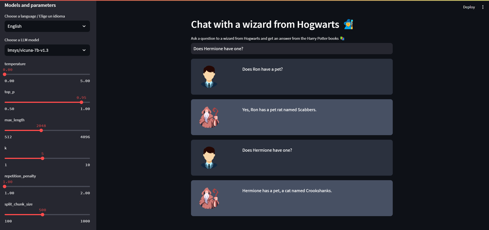
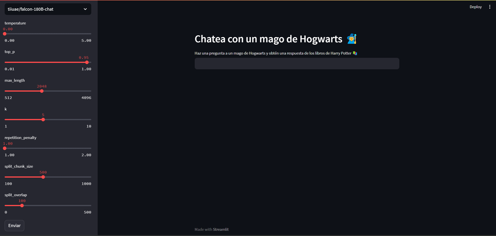

# HarryPotter Chatbot App

----------------------------
## Introduction

----------------------------
This is an educational project to learn how to build a question answering chatbot from Harry Potter books
using the [LangChain](https://github.com/langchain-ai/langchain) and [Hugging Face](https://huggingface.co/)
libraries. This model runs on a [Streamlit](https://streamlit.io/) app.

## How It Works

----------------------------


The application follows these steps to provide responses to your questions:

1. Document Loading: The app reads Harry Potter books in different languages and extracts their text content.

2. Splitting: The extracted text is divided into smaller chunks that can be processed effectively.

3. Language Model: The application creates vector representations (embeddings) of the text chunks using a language model.

4. Retrieval: The app analyzes the text chunks in relation to the question you ask to determine which ones are the most semantically comparable.

5. Response Generation: The language model receives the chosen chunks and produces a response based on the Harry Potter Book content.

## Dependencies and Installation

----------------------------
To replicate the HarryPotter Chat App, please follow these steps:

1. Clone the repository to your local machine.

2. Install the required dependencies by running the following command:
   ```
   pip install -r requirements.txt
   ```
   
## Usage

-----
To use the HarryPotter Chat App, follow these steps:

1. Ensure that you have installed the required dependencies.

2. Run the `chatbotapp.py` file using the Streamlit CLI. Execute the following command:
   ```
   streamlit run chatbotapp.py
   ```

3. The application will launch in your default web browser, displaying the user interface.

4. Select your preferred language (currently supports English and Spanish), select a language model and click on the
   `Send` button.

5. There are options to change hyperparameters like temperature, top_p, repetition_penalty, etc.

6. Ask questions in natural language about the Harry Potter Universe.





## License

----------------------------
The HarryPotter Chatbot App is released under the [MIT License](https://opensource.org/licenses/MIT).